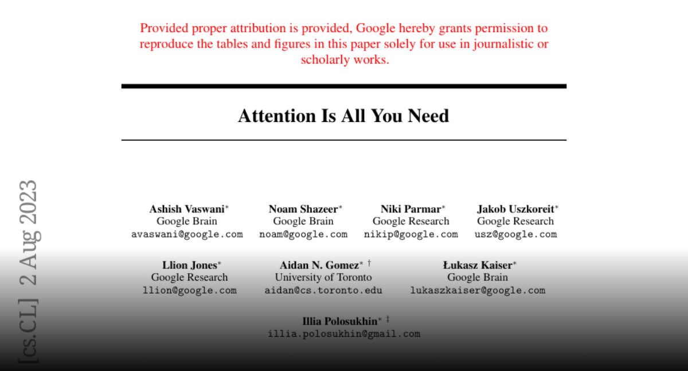
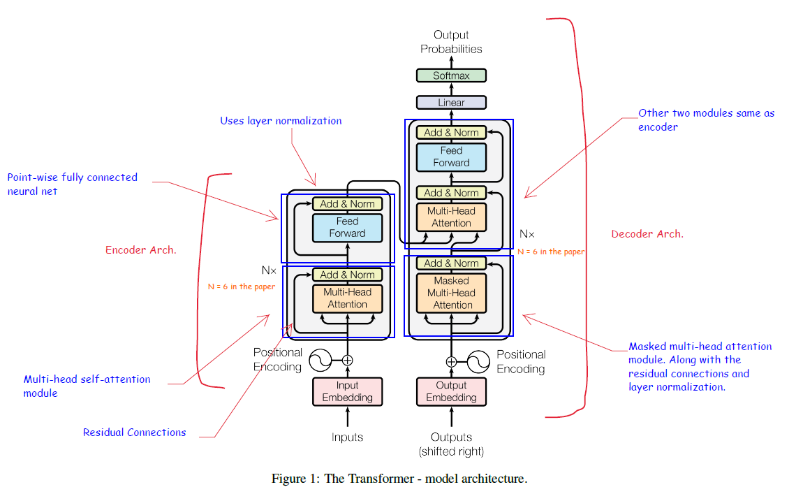
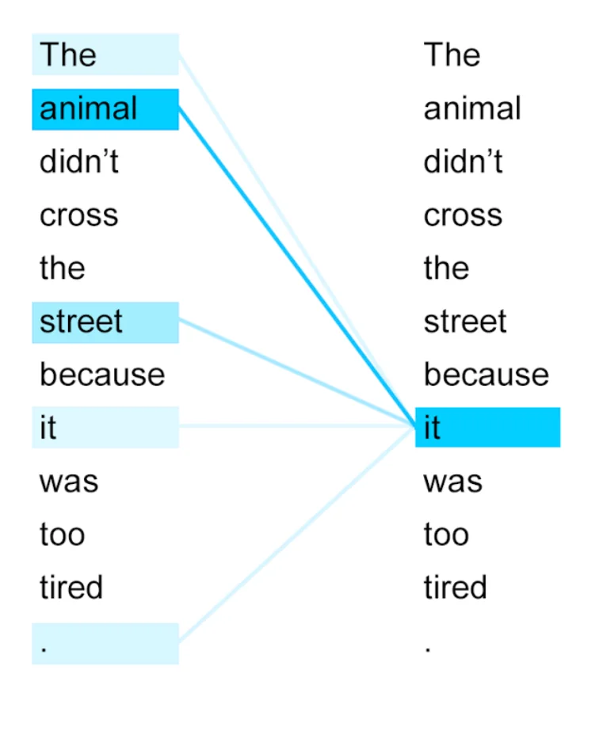
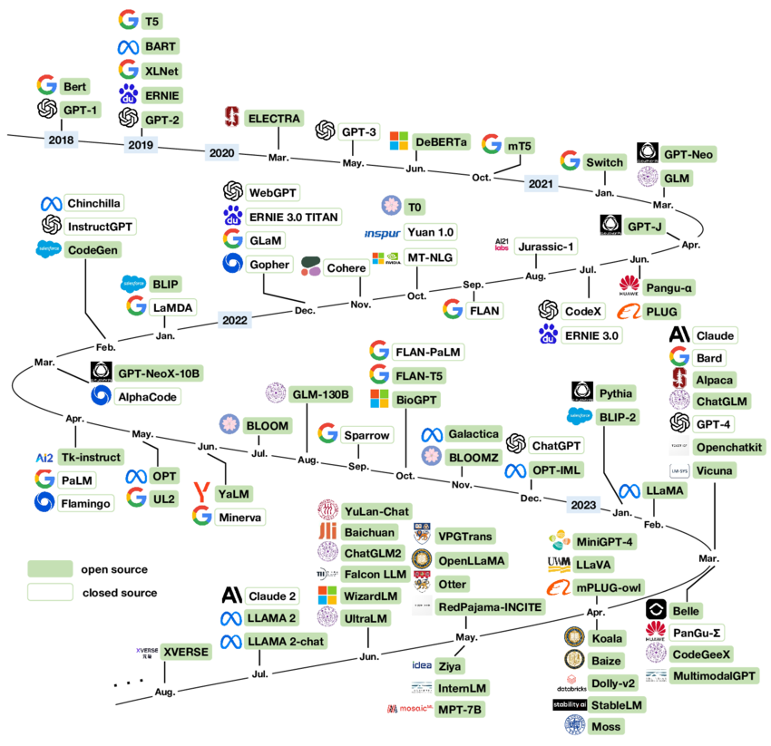

# Session 1: LLM Foundations & Evolution
*Vibe Code Like a Professional Developer Course*

## 🎯 Learning Objectives
By the end of this session, you will:
- Understand the historical evolution of language models and their impact on modern development
- Comprehend the transformer architecture and attention mechanisms that power today's AI tools
- Analyze key AI breakthroughs that led to the current AI-powered development landscape
- Gain foundational knowledge to effectively leverage AI coding assistants

---

## 1.1 The Transformer Revolution

### "Attention Is All You Need" - The Paper That Changed Everything

**Paper**: [Attention Is All You Need](https://arxiv.org/abs/1706.03762)

In 2017, a team at Google published a paper with a bold title: "Attention Is All You Need." This wasn't just academic hubris—it was a declaration that would fundamentally reshape artificial intelligence and, by extension, how we code today.



#### Historical Context and Motivation

Before transformers, the AI world was dominated by recurrent neural networks (RNNs) and their variants. These models processed text sequentially, word by word, like reading a book from left to right. This created several problems:

- **Sequential Processing**: RNNs couldn't be parallelized effectively, making training slow
- **Memory Limitations**: Long sequences suffered from vanishing gradients
- **Context Loss**: Important information from early parts of sequences was often forgotten

The transformer architecture solved these problems with a revolutionary approach: **attention mechanisms** that could look at all parts of a sequence simultaneously.



#### Key Innovations: Self-Attention and Multi-Head Attention

**Self-Attention Mechanism**
```
For each word in a sentence, self-attention asks:
"Which other words in this sentence are most relevant to understanding this word?"

Example: "The cat sat on the mat because it was comfortable"
- When processing "it", self-attention strongly attends to "cat" and "mat"
- The model learns that "it" refers to "cat" (not "mat") based on context
```


**Multi-Head Attention**
Instead of using one attention mechanism, transformers use multiple "heads" that focus on different aspects:
- Head 1: Might focus on grammatical relationships
- Head 2: Might focus on semantic meaning
- Head 3: Might focus on long-range dependencies

This allows the model to capture complex relationships that single attention mechanisms might miss.

#### Architecture Breakdown: Encoder-Decoder Structure

The original transformer consists of two main components:

**Encoder Stack**
- Takes input sequence and creates rich representations
- Each layer has: Multi-head attention → Add & Norm → Feed-forward → Add & Norm
- Processes all positions simultaneously (parallel processing)

**Decoder Stack**
- Generates output sequence one token at a time
- Uses masked self-attention (can't look ahead)
- Also attends to encoder outputs

**Key Components:**
- **Positional Encoding**: Since there's no inherent sequence order, position information is added
- **Residual Connections**: Help with gradient flow during training
- **Layer Normalization**: Stabilizes training

#### Impact on NLP and Beyond

The transformer's impact was immediate and profound:
- **Translation**: Achieved state-of-the-art results on multiple language pairs
- **Text Generation**: Enabled more coherent and contextually appropriate generation
- **Transfer Learning**: Pre-trained transformers could be fine-tuned for specific tasks
- **Scalability**: Could effectively utilize larger datasets and more computational power

---

## 1.2 Language Model Evolution Timeline

### Pre-Transformer Era: The Foundations

**Statistical Language Models (1980s-2000s)**
- N-gram models: Predicted next word based on previous N words
- Limited context window (usually 3-5 words)
- Sparse representations, couldn't generalize well

**Neural Language Models (2000s-2010s)**
```
Word2Vec (2013): "king - man + woman = queen"
- Dense word representations
- Captured semantic relationships
- But still limited context understanding
```

**Recurrent Neural Networks (2010s)**
- **RNNs**: Could process sequences of arbitrary length
- **LSTMs**: Solved vanishing gradient problem
- **GRUs**: Simplified LSTM variant
- **Limitations**: Sequential processing, long-range dependency issues

### Transformer Era Milestones


#### GPT-1 (2018): Generative Pre-Training Revolution
**Key Innovation**: Unsupervised pre-training + supervised fine-tuning
- **Architecture**: Decoder-only transformer (117M parameters)
- **Training Approach**: 
  1. Pre-train on large corpus of text (predict next word)
  2. Fine-tune on specific tasks
- **Breakthrough**: Showed that language models could be "universal learners"

```python
# GPT-1 approach simplified
# Pre-training: Learn to predict next word
"The cat sat on the" → "mat"
"Machine learning is" → "powerful"

# Fine-tuning: Adapt to specific tasks
"Sentiment: I love this movie" → "Positive"
"Translate: Hello" → "Hola"
```

#### BERT (2018): Bidirectional Representations
**Key Innovation**: Bidirectional context understanding
- **Architecture**: Encoder-only transformer (110M-340M parameters)
- **Training**: Masked Language Modeling (MLM)
- **Impact**: Achieved state-of-the-art on 11 NLP tasks

```python
# BERT's Masked Language Modeling
"The [MASK] sat on the mat" → "cat"
"I love [MASK] movie" → "this"
```

#### GPT-2 (2019): Scaling and Controversy
**Key Innovation**: Scale and zero-shot task performance
- **Architecture**: Larger decoder-only transformer (1.5B parameters)
- **Training**: Just predict next word, no task-specific fine-tuning
- **Controversy**: Initially considered "too dangerous to release"
- **Breakthrough**: Showed emergent abilities with scale

```python
# GPT-2 zero-shot capabilities
Prompt: "Translate English to French: Hello"
Output: "Bonjour"

Prompt: "Summarize: [long article]"
Output: "The article discusses..."
```

#### GPT-3 (2020): Few-Shot Learning Breakthrough
**Key Innovation**: In-context learning and few-shot capabilities
- **Architecture**: Massive decoder-only transformer (175B parameters)
- **Training**: Same as GPT-2 but much larger scale
- **Breakthrough**: Could perform tasks with just examples in the prompt

```python
# GPT-3 few-shot learning
Prompt: """
Translate English to French:
English: Hello
French: Bonjour
English: How are you?
French: Comment allez-vous?
English: Good morning
French:"""
Output: "Bonjour"
```

### The Scaling Hypothesis

A key insight from this evolution: **Scale matters enormously**
- More parameters → Better performance
- More data → Better performance  
- More compute → Better performance

This led to the "scaling laws" that predict model performance based on these factors.

---

## 1.3 ChatGPT and the AI Renaissance

### The November 2022 Announcement That Changed Everything

On November 30, 2022, OpenAI quietly released ChatGPT. Within 5 days, it had 1 million users. Within 60 days, it had 100 million users—the fastest-growing consumer application in history.

#### Technical Improvements Over GPT-3

**ChatGPT vs GPT-3: Key Differences**

| Aspect | GPT-3 | ChatGPT |
|--------|-------|---------|
| **Training** | Pre-training only | Pre-training + RLHF |
| **Interface** | API/Playground | Conversational UI |
| **Behavior** | Completion-focused | Dialog-optimized |
| **Safety** | Basic filtering | Extensive alignment |
| **Usability** | Developer-focused | Consumer-friendly |

**Reinforcement Learning from Human Feedback (RLHF)**
```
1. Pre-train language model (GPT-3.5)
2. Collect human feedback on model outputs
3. Train reward model to predict human preferences
4. Use reinforcement learning to optimize for reward
```

This process made ChatGPT:
- More helpful and harmless
- Better at following instructions
- More engaging in conversation
- Less likely to produce harmful content

---

### The AI Arms Race

#### Major Players and Their Responses

**Google's Response: Bard**
- Based on LaMDA (Language Model for Dialogue Applications)
- Focused on search integration
- Launched March 2023

**Microsoft's Integration: Bing Chat**
- Integrated GPT-4 into Bing search
- Launched February 2023
- Demonstrated AI-powered search capabilities

**Anthropic's Claude**
- Focused on AI safety and alignment
- Constitutional AI approach
- Emphasis on helpful, harmless, and honest AI

**Meta's LLaMA**
- Open-source approach
- Multiple model sizes (7B, 13B, 30B, 65B parameters)
- Democratized access to large language models

#### The Open Source Movement

**Key Open Source Models:**
- **LLaMA**: Meta's foundational models
- **Alpaca**: Stanford's instruction-tuned LLaMA
- **Vicuna**: UC Berkeley's chatbot
- **Mistral**: French company's efficient models

**Impact of Open Source:**
- Democratized AI development
- Accelerated research and innovation
- Enabled smaller companies to compete
- Created privacy-focused alternatives

---

## 1.4 LLM Mechanisms Deep Dive

### Core Architecture Components

#### Tokenization and Embedding

**Tokenization Process**
```python
# Example tokenization (simplified)
text = "Hello, world!"
tokens = ["Hello", ",", "world", "!"]
token_ids = [15496, 11, 995, 0]
```

**Subword Tokenization (BPE - Byte Pair Encoding)**
```python
# Handling rare words
"unhappiness" → ["un", "happiness"]
"ChatGPT" → ["Chat", "GPT"]
```

**Embedding Layer**
- Converts token IDs to dense vectors
- Learned during training
- Captures semantic relationships

#### Multi-Head Attention Mechanisms

**Attention Score Calculation**
```python
# Simplified attention mechanism
def attention(query, key, value):
    # Calculate attention scores
    scores = query @ key.T / sqrt(d_k)
    # Apply softmax to get probabilities
    probs = softmax(scores)
    # Weighted sum of values
    output = probs @ value
    return output
```

**Multi-Head Attention**
- Multiple attention heads run in parallel
- Each head learns different types of relationships
- Outputs are concatenated and projected

#### Feed-Forward Networks

**Purpose**: After attention, each position is processed independently
```python
# Two-layer feed-forward network
def ffn(x):
    return linear_2(relu(linear_1(x)))
```

**Characteristics**:
- Massive parameter count (often 4x the embedding dimension)
- Where much of the "knowledge" is stored
- Applied position-wise

#### Layer Normalization and Residual Connections

**Residual Connections**
```python
# Residual connection pattern
x = x + multi_head_attention(x)
x = x + feed_forward(x)
```

**Layer Normalization**
- Stabilizes training
- Applied before or after each sub-layer
- Helps with gradient flow

### Training Process

#### Pre-Training on Massive Datasets

**Dataset Composition** (typical for large models):
- **Web Text**: Filtered web pages (40-50%)
- **Books**: Digital books and literature (20-30%)
- **News**: News articles and journalism (10-15%)
- **Academic**: Research papers and journals (5-10%)
- **Reference**: Wikipedia and encyclopedias (5-10%)

**Training Objective**: Next Token Prediction
```python
# Self-supervised learning
input_sequence = "The cat sat on the"
target = "mat"
# Model learns to predict 'mat' given the context
```

**Scale of Training**:
- **GPT-3**: 300 billion tokens
- **GPT-4**: Estimated 10+ trillion tokens
- **Training Time**: Months on thousands of GPUs
- **Cost**: Millions of dollars

#### Fine-Tuning and RLHF

**Supervised Fine-Tuning (SFT)**
```python
# Instruction following examples
{
    "instruction": "Explain photosynthesis",
    "output": "Photosynthesis is the process by which..."
}
```

**Reinforcement Learning from Human Feedback**
1. **Reward Model Training**:
   - Humans rank model outputs
   - Train model to predict human preferences
   
2. **Policy Optimization**:
   - Use reinforcement learning (PPO)
   - Optimize for higher reward scores

#### Alignment Techniques

**Constitutional AI (Anthropic's Approach)**
- Models critique and revise their own outputs
- Based on a set of principles or "constitution"
- Reduces need for human feedback

**Red Teaming**
- Adversarial testing for harmful outputs
- Identify and fix potential misuse cases
- Continuous improvement process
